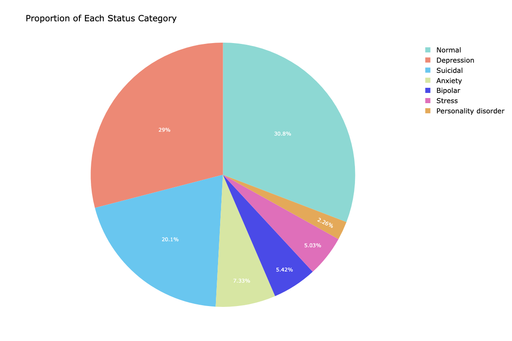
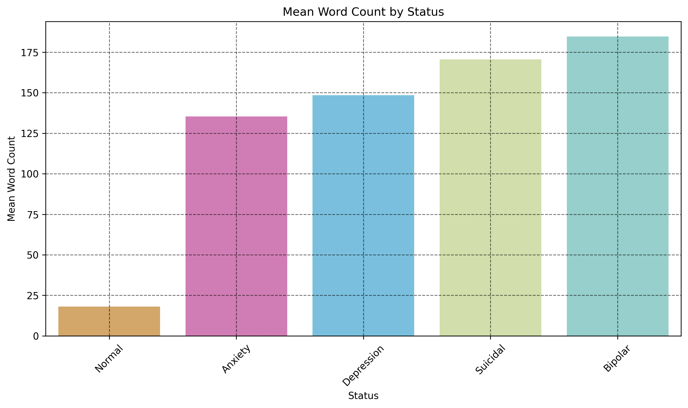
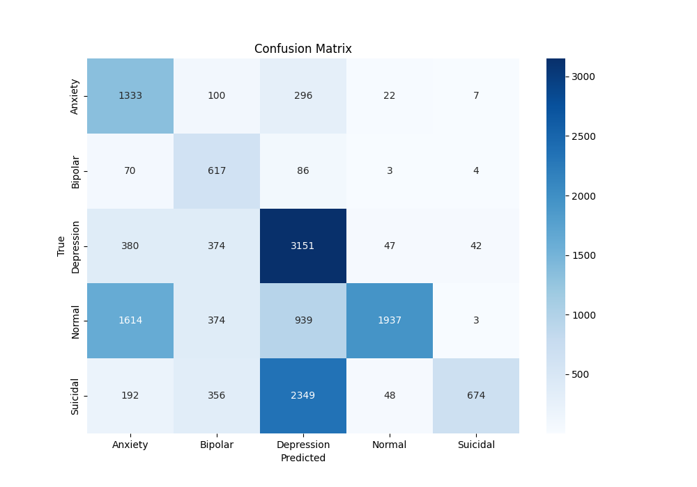
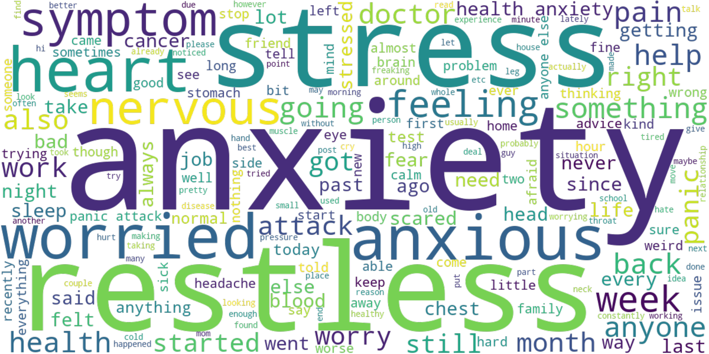

# Using NLP to Classify Mood Disorders

# Overview

This project analyzes an integrated dataset from Kaggle: a CSV file of compiled and cleaned data from 9 different sources pulling and classifying social media posts into 7 mental health statuses.

The data can be accessed here: [Sentiment Analysis for Mental Health](https://www.kaggle.com/datasets/suchintikasarkar/sentiment-analysis-for-mental-health/data) 

# Business Problem

According to the *World Health Organization*, in 2019 970 million people were living with a mental disorder. COVID-19 exacerbated this, with a 26% and 28% increase in anxiety and major depressive disorders, respectively. With the surge in technological advancements and use of social media, paired with a greater shift toward remote and virtual communications as a result of the pandemic...accessible, online resources for people seeking mental health support are essential. 

- My goal is to build a Natural Language Processing Model which can analyze a person’s posts on social media, and accurately categorize whether they have a mood disorder, as well as which disorder they have if relevant
- By identifying key words, engineering additional important features, and fine tuning the best model, we can hope to use this information to develop a chatbot that can direct people to further relevant resources (such as therapists specializing in the particular mood disorder a person needs help with)

# Data Understanding

Due to size constraints of these data sources, I am not able to store the raw data in the online repository where this analysis resides. If the reader wishes to explore those data sets or run the code within this file, it will be necessary to find the sources online and download them. These sources include:
- [3k Conversations Dataset for Chatbot](https://www.kaggle.com/datasets/kreeshrajani/3k-conversations-dataset-for-chatbot)
- [Depression Reddit Cleaned](https://www.kaggle.com/datasets/infamouscoder/depression-reddit-cleaned)
- [Human Stress Prediction](https://www.kaggle.com/datasets/kreeshrajani/human-stress-prediction)
- [Predicting Anxiety in Mental Health Data](https://www.kaggle.com/datasets/michellevp/predicting-anxiety-in-mental-health-data)
- [Mental Health Dataset Bipolar](https://www.kaggle.com/datasets/neelghoshal/reddit-mental-health-data)
- [Reddit Mental Health Data](https://www.kaggle.com/datasets/neelghoshal/reddit-mental-health-data)
- [Students Anxiety and Depression Dataset](https://www.kaggle.com/datasets/sahasourav17/students-anxiety-and-depression-dataset)
- [Suicidal Mental Health Dataset](https://www.kaggle.com/datasets/aradhakkandhari/suicidal-mental-health-dataset)
- [Suicidal Tweet Detection Dataset](https://www.kaggle.com/datasets/aunanya875/suicidal-tweet-detection-dataset)

# Data Preparation

The initial dataset was over 51,000 rows with 7 different classes to predict in our target variable. Our classes were highly imbalanced.

One of my main tasks was balancing detail-oriented fine tuning with reducing computational expense. A huge part of data preparation was trying to cut off as much of the “dead weight” as possible, to reduce noise and be able to parse through which features are truly important and unique to predicting our different target classes. To cut the “dead weight” I dropped stop words, punctuation and special characters (such as emojis), combined classes where possible, and ended up dropping our ‘Normal’ status rows altogether. To be meticulous and detail-oriented with regards to identifying and engineering rare, predictive features, I used lemmatization rather than stemming on tokenized words, and combed through bigrams and tokens common to multiple classes to relabel rows where necessary. 

New numeric features were created (such as Percentage of Upper-Case Words, and Exclamation Point Count) that might aide my model and allow me to drop more unnecessary tokens.

To prepare data for all models I used TF-IDF Vectorization. 

# Modeling

The scikit-learn package was primarily used to run Multinomial Naive Bayes, Multinomial Logistic Regression, and Random Forest. I quickly realized our dataset was quite messy, large, and overly complex, and at first Multinomial Naive Bayes was the only model that would successfully run without worker timeouts, errors regarding max_iterations, etc. A large part of my tuning was figuring out the best way to select features (SelectKBest with chi-squared ended up being our most helpful feature selection tool when possible), as well as figuring out how many maximum features, and/or maximum iterations a model needed to run without running a high risk of overfitting. 

Other hyper-parameters were tested and tuned, but balancing a model’s need for many features and/or iterations to run, with protecting against overfitting was my main struggle.

The classes were heavily imbalanced, so adjusting class weights (class_prior for Naive Bayes) was also essential. Relabeling the 'status' of rows where appropriate (using tokens and bigrams do identify mislabeled disorders) also helped class imbalance and our model's scores.

Confusion Matrix from baseling Multinomial Naive Bayes model that shows evidence of severe mislabeling among status groups: 

# Evaluation

Random Forest was the most successful model. My main metric was ***F1-score*** (weighted to account for imbalance): false positives and false negatives run equal measures of risk...for example when misdiagnosis of a mood disorder results in incorrect prescribed medications that severely alter brain chemistry, or suicidal threats are mislabeled leading to a lack of proper immediate assistance and intervention. Furthermore F1 Score is helpful when classes are imbalanced. 

I used train-test-split and k-fold cross-validation.

(XGBoost was also tested at the very end, but it yielded similar results to our final Random Forest model. I’ve picked random forest because it is less computational expensive.)

Initial scores on the first Naive Bayes model were (as I said, Random Forest would not even successfully run): 

**Baseline Best F1 Score**: 0.4305

**Baseline Test Set Score**: 0.4659

There were continued discrepancies between a model’s Best F1 Score and Test Set Score at the start of this project, as I continued to run models trying to get them to work. After much careful tuning and feature engineering, my final models yielded nearly identical scores between Best F1 and Test Set. 

Final Random Forest mode scores were:

**Final Best F1 Score**: 0.7643

**Final Test Set Score**: 0.7668

Key words unique to each status group that greatly helped my final model's succes were identified using TF-IDF. Example word-cloud below of unique, important tokens to **Anxiety** status group.

# Conclusion: Random Forest (Further Tuning Needed)

Given the complexity and messiness of this dataset, I’m very happy with the proportional magnitude at which my final scores had improved from my baseline model, even if there’s still room for further improvement.
